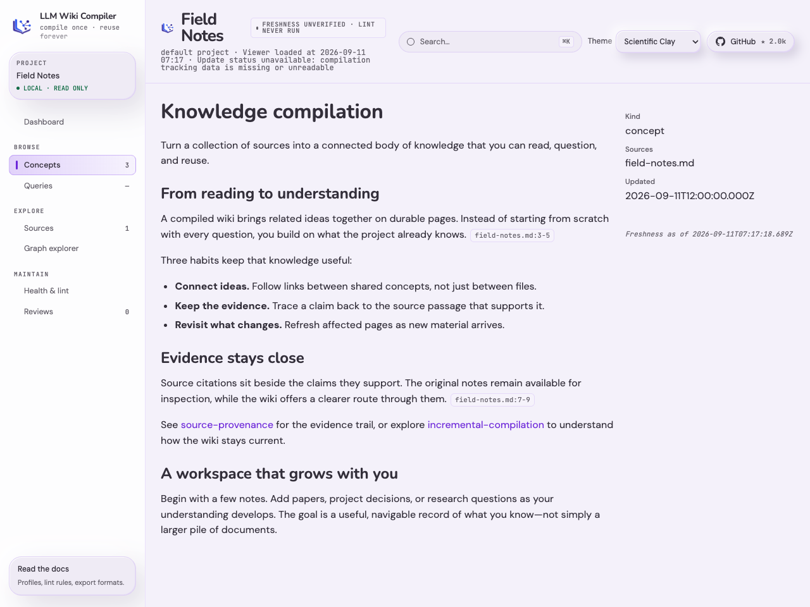
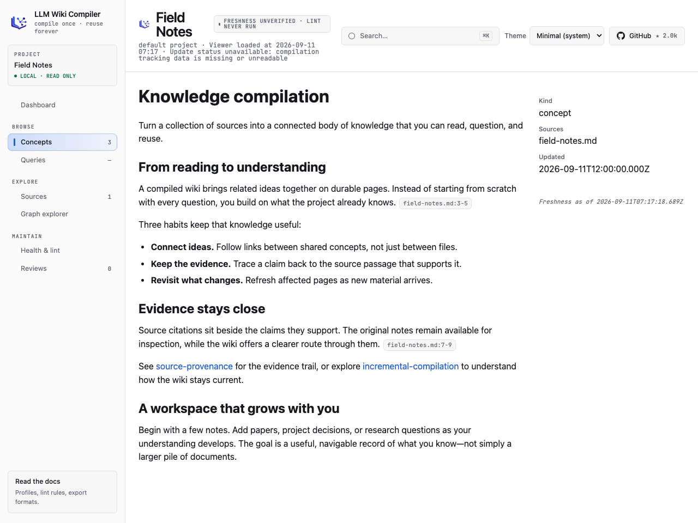

# llmwiki

> This repository contains self-maintained llmwiki code and general deployment tooling. Keep project mappings, machine identity, Wiki content, transcripts, credentials, and runtime state outside Git. The committed deployment template is neutral and defaults to reader mode; pass a private full configuration with `--config-source` when installing. See the [deployment guide](deployment/README.md) for details. The product overview below describes llmwiki itself.

[](https://github.com/atomicstrata/llm-wiki-compiler/actions/workflows/ci.yml)
[](https://www.npmjs.com/package/llm-wiki-compiler)
[](https://llmwiki.atomicstrata.ai)
[](LICENSE)

## New in 1.3 — A fresh look for your wiki.

Meet Scientific Clay, with soft surfaces and rounded typography, and Minimal, which follows your system’s light or dark setting. Switch instantly between four themes, including Nebula Light and Dark.

<table>
  <tr><th>Scientific Clay</th><th>Minimal</th></tr>
  <tr>
    <td width="50%"><a href="docs/images/viewer-scientific-clay.png"></a></td>
    <td width="50%"><a href="docs/images/viewer-minimal.png"></a></td>
  </tr>
</table>

The same page in a demonstration wiki. Click either screenshot for a closer look.

Recursive source folders, path exclusions, project-specific compile instructions, and storage for larger embedding indexes.

### Configurable Lifecycle Profiles — introduced in 1.0.

Build a domain-specific wiki with typed records, relationships, lifecycle gates, and workflows defined in one validated profile. Start with AutoSci or Newsroom, or create your own.

### New in 1.2 — Explore your records and their evidence.

Browse profile-defined categories, declared fields, connected records, provenance, and supporting source passages in the local viewer.

### New in 1.1 — Publish and share domain templates.

Create signed template distributions, discover them through explicitly trusted catalogs, and install or update them with compatibility checks.

---

## What llmwiki does

Compile raw sources into an interlinked, citation-traceable markdown wiki that agents and humans can browse, query, lint, export, and reuse. The default profile preserves the classic concepts-and-queries layout; optional profiles add domain-specific types and workflows without adding domain branches to the compiler.

llmwiki implements the [LLM Wiki](https://gist.github.com/karpathy/442a6bf555914893e9891c11519de94f) pattern: instead of re-discovering knowledge from raw files at query time, compile it once into durable pages that accumulate structure, provenance, review state, and retrieval metadata over time.

## When to use this repo

Use llmwiki when you need a persistent knowledge base from raw material:

- Compile papers, notes, READMEs, transcripts, PDFs, images, or web pages into typed wiki pages.
- Give agents a stable, citation-aware context pack instead of a pile of loose files.
- Keep generated knowledge auditable with source citations, review queues, freshness checks, and quality gates.
- Browse the result locally, query it from the CLI, expose it over MCP, or embed it through the SDK.
- Exchange compiled knowledge with other tools using Open Knowledge Format (OKF), JSON, JSON-LD, GraphML, Marp, and `llms.txt`.

Do not use llmwiki as a general static-site generator, a heavy ontology database, or a replacement for ad-hoc search over fast-changing raw logs. It is strongest when source knowledge is worth compiling, reviewing, and reusing.

## What you get

- **Compiled wiki, not chunks.** A two-phase LLM pipeline extracts concepts, then generates typed pages: `concept`, `entity`, `comparison`, and `overview`.
- **Configurable Lifecycle Profiles.** A fail-closed `.llmwiki/profile.json` can declare entity schemas, typed relations, lifecycle state machines, transition requirements, workflows, artifacts, connectors, content tiers, and retrieval policy.
- **Installable domain templates.** `llmwiki template init autosci` creates a research project with papers, ideas, experiments, manuscripts, evidence artifacts, workflows, and Crossref import. `newsroom` demonstrates the same machinery for editorial work.
- **Runtime trust gates.** Relation, evidence, artifact, and human/agent gates are enforced by the write path rather than left as prompt conventions; standing lint detects drift after the fact.
- **Citation-traceable output.** Paragraphs and claims cite source files and line ranges, and `llmwiki lint` validates the links.
- **Hybrid retrieval.** Semantic chunk search, BM25 reranking, and wikilink graph expansion build compact evidence packs for queries and agents.
- **Local viewer.** `llmwiki view` opens a read-only browser UI with search, page metadata, graph exploration, source-freshness badges, and citation chips.
- **Review policy.** Generated pages can be auto-held for review when confidence, contradiction, schema, or provenance rules trip.
- **Freshness repair.** `llmwiki lint` and `llmwiki next` surface stale/orphaned pages; `llmwiki refresh --stale` repairs changed knowledge without compiling unrelated new sources.
- **Eval harness.** `llmwiki eval` reports health score, a per-page health distribution that flags the worst pages, wikilink-graph health, citation coverage/precision, corpus stats, regression deltas, and optional judge-model citation support.
- **MCP server.** `llmwiki serve` exposes ingest, compile, query, lint, read, status, eval, context-pack, and OKF exchange tools to MCP-compatible agents.
- **SDK.** `createWiki({ root })` drives ingest, compile, query, context, status, export, eval, and OKF import/export from TypeScript without shelling out.
- **Open Knowledge Format exchange.** Export and import OKF bundles for portable, markdown-native knowledge exchange. External OKF imports are staged through the review queue by default; trusted bundles can be written live explicitly.
- **Other portable exports.** Export JSON, JSON-LD, GraphML, Marp slides, and `llms.txt` for downstream systems.
- **Provider portable.** Anthropic, Claude Agent SDK local login, OpenAI Codex CLI local login, OpenAI-compatible servers, Ollama, GitHub Copilot, Atlas Cloud, OrcaRouter, and local OpenAI-compatible runtimes.

## Configurable Lifecycle Profiles (CLP)

CLP turns llmwiki's knowledge compiler into a reusable substrate for domain-specific knowledge systems. A validated `.llmwiki/profile.json` is the single contract for:

- typed entities, fields, and directed relations;
- lifecycle states, transition evidence, and trust gates;
- multi-stage workflows and declared actions;
- hash-pinned artifacts and first-party connector bindings; and
- content tiers and retrieval behavior.

These rules are enforced by the runtime, not left as prompt conventions. The CLI, SDK, MCP server, viewer, context builder, lint, status, export, and OKF exchange surfaces all operate from the same profile contract. Invalid profiles and writes that bypass a declared gate fail closed.

CLP is backward-compatible by construction: a project without `.llmwiki/profile.json` uses the built-in default concepts-and-queries profile and preserves the pre-1.0 behavior. You can start three ways — scaffold your own profile, install a built-in or local template, or install a signed template from a trusted tap:

```bash
# author your own profile, one entity type at a time
llmwiki profile init research --entity paper

# or install a built-in or local declarative template
llmwiki template list
llmwiki template inspect autosci
llmwiki template init autosci

llmwiki profile validate
llmwiki workflow list
```

`autosci` is a practical research system with papers, ideas, experiments, manuscripts, evidence artifacts, workflows, and Crossref ingestion. `newsroom` applies the same generic machinery to articles, desks, bylines, and editorial workflows. Templates contain configuration and examples, never executable plugin code.

Templates can also be distributed securely. Publishers build signed, offline distributions with `llmwiki template publish` — Ed25519 signing, key rotation, and package revocation — and verify them with `template publish verify`. Consumers add explicitly trusted taps, discover and inspect signed catalogs, and install or update templates with continuity, revocation, and compatibility checks enforced under lock.

Read the [CLP concept guide](docs/concepts/configurable-lifecycle-profiles.mdx), follow the [AutoSci research workflow](docs/guides/autosci-research-workflow.mdx), or explore the [Newsroom editorial workflow](docs/guides/newsroom-editorial-workflow.mdx).

## Karpathy's LLM Wiki pattern

Andrej Karpathy described the LLM Wiki pattern as a way to turn raw material into compiled knowledge that future agents can reuse. llmwiki is a concrete compiler for that pattern.

The key shift is moving work from query time to compile time. Traditional RAG repeatedly retrieves raw chunks and asks the model to reconstruct relationships for each question. llmwiki first turns sources into typed, interlinked pages with citations, metadata, and review state. Queries, context packs, exports, and MCP tools then operate over that compiled artifact.

That makes llmwiki useful when knowledge should compound: concepts shared across sources become one page, saved answers become future context, stale pages can be detected and repaired, and agents can consume a stable evidence pack instead of re-reading the same raw files from scratch.

See [`docs/concepts/karpathy-pattern.mdx`](docs/concepts/karpathy-pattern.mdx) for the deeper explanation.

## Agent decision guide

If an agent is scanning this README, these are the high-signal entry points:

| Goal | Use |
|---|---|
| Create a wiki from one source and inspect it | `llmwiki quickstart <source>` |
| Start a typed research or editorial project | `llmwiki template list`, then `llmwiki template init autosci\|newsroom` |
| Inspect or validate the active domain contract | `llmwiki profile show` and `llmwiki profile validate` |
| Run a declared lifecycle workflow | `llmwiki workflow list`, then `llmwiki workflow start <id>` |
| Write or verify a profile-declared artifact | `llmwiki artifact write ...` and `llmwiki artifact verify <ref>` |
| Import external records through a connector | `llmwiki connector list`, then `llmwiki connector run <id> --input key=value` |
| Add more files or URLs | `llmwiki ingest <url-or-file>` |
| Compile or recompile changed sources | `llmwiki compile` |
| Add project-specific writing guidance | [`llmwiki compile --instructions ./SOUL.md`](docs/cli/compile.mdx#project-instructions); pass the option on each instructed compile |
| Remove a bad source and its derived pages | `llmwiki rm <source>` |
| Hold generated pages for human approval | `llmwiki compile --review` or review policy config |
| Ask grounded questions | `llmwiki query "question"` |
| Save an answer back into the wiki | `llmwiki query "question" --save` |
| Build an evidence pack for another agent | `llmwiki context "<task>" --json` or MCP `get_context_pack` |
| Inspect the compiled knowledge base | `llmwiki view --open` |
| Check broken links, citations, confidence, freshness, and quality | `llmwiki lint` and `llmwiki eval` |
| Repair stale compiled pages | `llmwiki refresh --stale --dry-run`, then `llmwiki refresh --stale` |
| Drive llmwiki from an agent | `llmwiki serve --root <project>` |
| Drive llmwiki from TypeScript | `createWiki({ root })` |
| Export for another system | `llmwiki export --target <format>` |
| Export an Open Knowledge Format bundle | `llmwiki export --target okf --out <dir>` |
| Import an Open Knowledge Format bundle | `llmwiki import --okf <dir> --dry-run`, then review/approve |

## Quick start

```bash
npm install -g llm-wiki-compiler

export ANTHROPIC_API_KEY=sk-...
# or choose another provider:
# export LLMWIKI_PROVIDER=openai
# export OPENAI_API_KEY=sk-...

llmwiki quickstart ./notes.md
llmwiki query "what are the key ideas?"
llmwiki view --open
```

`quickstart` ingests one source, compiles pages, and opens the viewer. Inside an existing project, run `llmwiki next` when you want the safest next action.

To start with a domain model instead of the default concepts-and-queries layout:

```bash
mkdir research-wiki && cd research-wiki
llmwiki template inspect autosci
llmwiki template init autosci
llmwiki profile validate
llmwiki workflow list
```

Template installation is for a new or empty typed project. It materializes the chosen profile into `.llmwiki/profile.json`; normal project loading never depends on a template registry or lockfile.

## Demo

Try it on any article or document:

```bash
mkdir my-wiki && cd my-wiki
llmwiki quickstart https://en.wikipedia.org/wiki/Andrej_Karpathy
llmwiki query "What terms did Andrej coin?"
```

The [`examples/basic/`](examples/basic/) directory includes a small pre-generated wiki you can inspect without an API key.

## Core commands

| Command | What it does |
|---|---|
| `llmwiki ingest <url-or-file>` | Fetch a URL or copy a local file into `sources/`. |
| `llmwiki ingest-session <path>` | Import exported Claude, Codex, or Cursor sessions into `sources/`. |
| `llmwiki quickstart <source>` | Ingest, compile, and optionally open the viewer in one step. |
| `llmwiki compile` | Incrementally extract concepts and generate wiki pages. |
| `llmwiki rm <source> [--dry-run]` | Delete a source and the concept pages derived exclusively from it. |
| `llmwiki refresh --stale [--dry-run]` | Recompile changed owners of stale pages and clean selected orphaned ownership. |
| `llmwiki template list\|inspect\|init` | Discover and install validated declarative profile templates. |
| `llmwiki profile init\|show\|validate\|diff` | Create a minimal profile, inspect it, validate it, or assess profile changes. |
| `llmwiki workflow ...` | Discover and drive profile-declared workflows, stages, gates, and outputs. |
| `llmwiki artifact write\|verify` | Write trusted profile-declared artifacts and verify hash-pinned references. |
| `llmwiki connector list\|run` | Discover first-party connectors and stage external records for review. |
| `llmwiki review list/show/approve/reject` | Inspect and manage held candidates. |
| `llmwiki query "question" [--save]` | Ask questions against the compiled wiki, optionally saving the answer. |
| `llmwiki context "<prompt>" --json` | Build a citation-aware evidence pack for agents. |
| `llmwiki view [--open]` | Start the read-only local browser viewer. |
| `llmwiki status [--json]` | Report page/source counts, stale and orphaned pages, pending work, and state health. |
| `llmwiki lint` | Validate wiki structure, citations, links, metadata, and freshness. |
| `llmwiki eval [--suite fast\|full]` | Measure wiki quality and optional citation support. |
| `llmwiki export --target <format>` | Export the wiki to portable formats, including Open Knowledge Format (`okf`). |
| `llmwiki import --okf <dir> [--dry-run] [--trusted]` | Import an Open Knowledge Format bundle, staged for review by default. |
| `llmwiki serve --root <dir>` | Start the MCP server. |

Full command docs live in [`docs/cli/`](docs/cli/).

## Open Knowledge Format

llmwiki is an Open Knowledge Format (OKF) producer and consumer. OKF is a Google Cloud initiative for sharing compiled knowledge as portable markdown files with structured frontmatter.

```bash
llmwiki export --target okf --out ./dist/okf
llmwiki import --okf ./dist/okf --dry-run
llmwiki import --okf ./dist/okf
```

OKF import is intentionally review-first: untrusted bundles become review candidates, not live wiki pages. The importer preserves foreign OKF metadata, stores llmwiki provenance under `x-llmwiki`, and re-exports imported pages honestly after local edits, including safe original nested paths.

See [`docs/guides/open-knowledge-format.mdx`](docs/guides/open-knowledge-format.mdx), [`docs/cli/export.mdx`](docs/cli/export.mdx), and [`docs/cli/import.mdx`](docs/cli/import.mdx).

## What llmwiki creates

A project has raw inputs in `sources/`, compiled markdown in `wiki/`, and compiler state under `.llmwiki/`:

```text
sources/
  raw source files
wiki/
  concepts/      compiled pages
  queries/       saved answers
  <entity>/      profile-declared typed pages
  graph/         typed relation and audit-event stores
  outputs/       derived workflow projections
  index.md       generated TOC
.llmwiki/
  profile.json   active domain contract
  template-lock.json  advisory install provenance
  config.json    review policy and source selection
  schema.json    page-kind/cross-link policy
  state.json     source hashes and ownership
  candidates/    held review candidates
  workflows/     signed workflow run state
  eval/          quality history and thresholds
artifacts/       hash-pinned profile-declared files and manifests
log.md           activity journal
```

Compiled pages are plain markdown with YAML frontmatter, plus enough metadata for agents to reason about citations, freshness, confidence, contradictions, and review state. See [`docs/concepts/wiki-model.mdx`](docs/concepts/wiki-model.mdx).

Sources are top-level Markdown files by default. Opt into [nested source folders and exclusions](docs/cli/compile.mdx#nested-source-folders) in project config. Excluding a compiled source retires its contribution on the next ordinary compile without deleting the source file.

## Agent integration

### MCP

Run:

```bash
llmwiki serve --root /path/to/wiki-project
```

MCP clients can ingest sources, compile, query, search pages, read pages, lint, run eval, inspect status, request context packs, and exchange OKF bundles. Read-only tools work without provider credentials; LLM-backed tools validate provider credentials at call time. The `run_eval` tool runs its fast suite without a provider; its full suite (which LLM-judges citation support) requires one.

See [`docs/guides/mcp-agent-integration.mdx`](docs/guides/mcp-agent-integration.mdx).

### SDK

```ts
import { createWiki } from "llm-wiki-compiler";

const wiki = createWiki({ root: "/path/to/wiki-project" });
await wiki.ingest({ source: "./notes.md" });
await wiki.compile();
const answer = await wiki.query({ question: "What changed?" });
```

See [`docs/guides/sdk.mdx`](docs/guides/sdk.mdx).

## Configuration

Minimum requirement: Node.js 24 or newer.

The default provider is Anthropic:

```bash
export ANTHROPIC_API_KEY=sk-...
```

Provider selection is environment-driven:

| Provider | Typical setup |
|---|---|
| Anthropic | `ANTHROPIC_API_KEY` or `ANTHROPIC_AUTH_TOKEN` |
| Claude Agent SDK | Local Claude Code login, `LLMWIKI_PROVIDER=claude-agent` |
| OpenAI Codex CLI | Local Codex login / ChatGPT subscription, `LLMWIKI_PROVIDER=codex-agent`; explicit embedding provider required |
| OpenAI-compatible | `LLMWIKI_PROVIDER=openai`, `OPENAI_API_KEY`, optional `OPENAI_BASE_URL` |
| Ollama | `LLMWIKI_PROVIDER=ollama`, `OLLAMA_HOST` |
| GitHub Copilot | `LLMWIKI_PROVIDER=copilot`, `GITHUB_TOKEN=$(gh auth token)` |
| Atlas Cloud | `LLMWIKI_PROVIDER=atlascloud`, `ATLASCLOUD_API_KEY` |
| OrcaRouter | `LLMWIKI_PROVIDER=orcarouter`, `ORCAROUTER_API_KEY` |

See [`docs/configuration/providers.mdx`](docs/configuration/providers.mdx) and [`docs/configuration/environment-variables.mdx`](docs/configuration/environment-variables.mdx).

## Quality and safety model

llmwiki is designed for auditable generated knowledge:

- **Review before write.** Use `compile --review` or `.llmwiki/config.json` review policy to hold risky pages as candidates.
- **Profile floors are runtime checks.** Field contracts, lifecycle transitions, relation counts, evidence, and artifact requirements are enforced across page, lifecycle, workflow, import, and approval write surfaces.
- **External connector data is untrusted.** First-party connectors use confined fetches and stage fenced review candidates; approval is pinned to the exact body the operator reviewed.
- **Artifacts are content-addressed evidence.** Artifact reads and writes are path-confined, size-capped, schema-checked, and verified against hash-pinned references.
- **Fail-closed config.** Invalid review-policy config aborts compile instead of silently disabling review.
- **Source confinement.** Source snippets and import/export paths are confined to the project.
- **Freshness is explicit.** Pages can be fresh, stale, orphaned, or unverified; stale pages are flagged and repairable. The JSON export is active-page-only: it carries freshness for live pages (`fresh`/`stale`/`unverified`); computed-orphaned pages (all sources deleted) surface only as lint and viewer signals and are dropped from the export.
- **Imported compiled knowledge is staged by default.** External bundles go through the review queue unless explicitly trusted.
- **CI gates are supported.** `llmwiki lint` and `llmwiki eval` can enforce quality thresholds.

See [`docs/configuration/review-policy.mdx`](docs/configuration/review-policy.mdx), [`docs/troubleshooting/stale-pages.mdx`](docs/troubleshooting/stale-pages.mdx), and [`docs/guides/ci-quality-gates.mdx`](docs/guides/ci-quality-gates.mdx).

## Scale and what works

llmwiki is still early software, but it is no longer a toy pipeline for a handful of notes.

- **Incremental compilation** means unchanged sources do not flow back through the LLM.
- **Parallel compile** runs concept extraction and page generation concurrently under a configurable cap (`--concurrency` / `LLMWIKI_COMPILE_CONCURRENCY`), cutting wall-clock on large compiles.
- **Chunk-level embeddings** narrow large wikis before BM25 reranking and graph expansion.
- **Content-hash-aware embedding updates** avoid recomputing vectors for unchanged pages and chunks.
- **Batch embedding** sends page and chunk vectors to the provider in batches rather than one request at a time, cutting latency on cold starts and large refreshes.
- **Binary embedding storage** automatically handles stores above the 64 MiB JSON limit; smaller stores can opt in. Binary selection persists, and retrieval still loads the index into memory. See [limits, recovery and downgrade guidance](docs/configuration/environment-variables.mdx#embedding-storage).
- **Cached citation judgements** make repeated `eval --suite full` runs cheaper.
- **Lexical fallback** keeps query/context workflows usable when the active provider has no embedding endpoint.
- **Prompt budgeting and ingest truncation metadata** make large sources explicit instead of silently pretending they fit.

The current sweet spot is a durable project or domain wiki: research folders, codebase docs, team handbooks, standards, design notes, decision logs, or curated source packs. The less ideal fit is a high-churn firehose where raw search is enough and compiled structure would go stale faster than it can be reviewed.

## Documentation

The full docs site source is in [`docs/`](docs/):

- Start here: [`docs/introduction.mdx`](docs/introduction.mdx)
- Quickstart: [`docs/quickstart.mdx`](docs/quickstart.mdx)
- Installation: [`docs/installation.mdx`](docs/installation.mdx)
- Karpathy's LLM Wiki pattern: [`docs/concepts/karpathy-pattern.mdx`](docs/concepts/karpathy-pattern.mdx)
- How the compiler works: [`docs/concepts/how-it-works.mdx`](docs/concepts/how-it-works.mdx)
- Wiki model: [`docs/concepts/wiki-model.mdx`](docs/concepts/wiki-model.mdx)
- Configurable Lifecycle Profiles: [`docs/concepts/configurable-lifecycle-profiles.mdx`](docs/concepts/configurable-lifecycle-profiles.mdx)
- AutoSci research workflow: [`docs/guides/autosci-research-workflow.mdx`](docs/guides/autosci-research-workflow.mdx)
- Newsroom editorial workflow: [`docs/guides/newsroom-editorial-workflow.mdx`](docs/guides/newsroom-editorial-workflow.mdx)
- Profile templates: [`docs/configuration/profile-templates.mdx`](docs/configuration/profile-templates.mdx)
- CLI reference: [`docs/cli/`](docs/cli/)
- Open Knowledge Format: [`docs/guides/open-knowledge-format.mdx`](docs/guides/open-knowledge-format.mdx)
- MCP integration: [`docs/guides/mcp-agent-integration.mdx`](docs/guides/mcp-agent-integration.mdx)
- SDK: [`docs/guides/sdk.mdx`](docs/guides/sdk.mdx)
- Atomic Memory bridge: [`docs/guides/atomic-memory-bridge.mdx`](docs/guides/atomic-memory-bridge.mdx)

Preview the docs locally with Node 24:

```bash
cd docs
volta run --node 24 npx mint dev --port 3001
```

## Current release

**Released `1.3.0`:**

- Four viewer themes, with Scientific Clay as the new default and Minimal following your system setting. Saved light/dark preferences migrate to Nebula Light/Dark.
- Recursive source discovery, literal path exclusions, and explicit project-specific compile instructions.
- Bounded binary storage for larger embedding indexes, configurable completion budgets, and protected gateway request extensions.
- OrcaRouter embedding routing, retryable rule-language changes, and a public test type-check ratchet.

See the [1.3.0 release summary](https://github.com/atomicstrata/llm-wiki-compiler/releases/tag/v1.3.0) and [changelog](CHANGELOG.md) for migration details, contributor credits, and limits.

**Released `1.2.0`:**

- Profile-aware viewer with document categories, record relationships, provenance, source previews, verified local artifact access, responsive navigation and fitted graphs.
- Additional providers and OpenAI-compatible reasoning-model controls, independent embedding configuration, and SDK embedding opt-out.
- Optional Sources sections and additive SDK system policies with prompt-change invalidation and per-page provenance.
- Shared-page recovery after source removal, citation line-list fixes, and conservative abbreviated-wikilink repair.

Windows path fixes are included, but native Windows validation and CI remain outstanding. Full filesystem-confinement guarantees on Windows remain unverified. Use a supported Linux environment for untrusted projects; see [#217](https://github.com/atomicstrata/llm-wiki-compiler/issues/217).

**Released `1.1.0`:**

- Template distribution ecosystem: publishers author signed, offline distributions with `template publish init | add | build | rotate | revoke` (Ed25519 signing, key rotation, package revocation) and verify them with `template publish verify`.
- Consumers configure explicitly trusted template taps, discover and inspect signed catalogs, and install or update templates with continuity, revocation, and compatibility checks under lock.
- `llmwiki status` command: a readable snapshot of page and source counts, last compile, stale and orphaned pages, pending changes, the review queue, active profile, and state-file health.

**Released `1.0.0`:**

- Configurable Lifecycle Profiles across CLI, SDK, MCP, viewer, context, lint, status, export, and profile-aware OKF exchange.
- Built-in `autosci` and `newsroom` templates, typed workflows and actions, first-class artifacts, typed relations and runtime lifecycle gates, plus a hardened first-party connector substrate with Crossref.
- Typed-page semantic search and retrieval controls, batch embeddings, parallel compile, and fail-closed state recovery.

See [`CHANGELOG.md`](CHANGELOG.md) for release history.

## Companion: Atomic Memory

llmwiki and [Atomic Memory](https://github.com/atomicstrata/atomicmemory) are complementary open context infrastructure:

- **llmwiki** compiles source material into durable, inspectable knowledge.
- **Atomic Memory** gives agents runtime memory that is searchable, scoped, correctable, and inspectable.

Use them independently or together. The [`@atomicmemory/llmwiki`](https://github.com/atomicstrata/atomicmemory/tree/main/packages/llmwiki) bridge imports `llmwiki export --target json --project-id <id>` as durable memory records.

## Contributing

Contributions are welcome. If llmwiki is missing something you need, open an issue or PR and describe the workflow you are trying to support - need-driven improvements are often the best ones. If you want to contribute more generally, roadmap items are a good place to start. For larger changes to core compile, review, import/export, or retrieval semantics, please start with an issue or design discussion so we can align on the contract first.

Before committing code changes, run:

```bash
npx tsc --noEmit
npm run build
npm test
npm run fallow:ci
```

See [`CONTRIBUTING.md`](CONTRIBUTING.md).

## License

MIT

## Disclaimer

No LLMs were harmed in the making of this repo.
